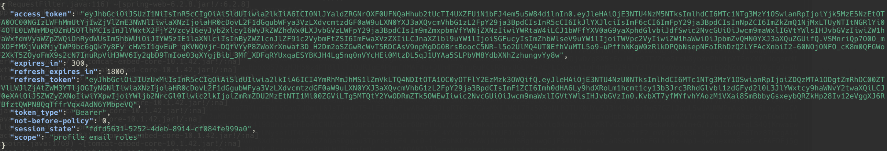

# Report sBOM Generator 

This components aims at generating reports in various for software bill of materials based on CycloneDX standard. More info on this standard can be found [here](https://cyclonedx.org/specification/overview/). 

## What does it do
Service offers an API to which other services or users can send sBOM documents (CycloneDX) and get back generated PDF/spread sheet files.

## How to install

Service so far supports running as Docker container and to be deployed to Kubernetes cluster. For Docker instructions see: https://hub.docker.com/r/starwitorg/sbom-generator

To install service to Kubernetes use Helm chart provided here: https://hub.docker.com/r/starwitorg/sbom-generator-chart

_Note:_ This application creates and ships an SBOM for itself. You can find it at: host:port/application.cdx.json

# Development
Documentation for developers - pull requests are always appreciated.

## How to run locally
As this is a Spring Boot app, compiling and running is simple:

```bash
mvn clean package
java -jar target/application-sbom-generator.jar 
```

__Note__: Build file contains a code signing step. Make sure to change config to your own signing key. For more details see [plugin page](https://maven.apache.org/plugins/maven-gpg-plugin/usage.html)

You can reach API via:

    http://localhost:8080/swagger-ui/index.html

### Test API

Application's SBOM is located here: http://localhost:8080/application.cdx.json

To generate a PDF report use the following API call:

```bash
curl -X 'POST' 'http://localhost:8080/api/report/remote' -H 'Content-Type: application/json' -d '{"sbomURI": ["http://localhost:8080/application.cdx.json"],"dcId": 0,"compact": true}' > report.pdf
```
This API call returns a binary PDF file which is then stored as _report.pdf_.

## Authentication

In order to use authentication, use sping profile "auth" in your application.properties:

```bash
spring.profiles.active=auth
```

You need a running openID compatible identity provider (IdP). In folder [deployment/docker-compose](deployment/docker-compose/auth-docker-compose.yml) you find a Docker compose file, that starts a pre-configured Keycloak running at http://localhost:8081/

### Manual API Access with Token Generation
If you use pre-configured Keycloak use the following command to get an access token. If you want to use another Keycloak, adapt command accordingly.
```bash
curl -H application/x-www-form-urlencoded -d "realm=default" -d "client_id=aicockpit" -d "username=admin" -d "password=admin" -d "grant_type=password" "http://localhost:8081/auth/realms/aicockpit/protocol/openid-connect/token"
```
__Hint:__ On bash you can use [jq](https://jqlang.org/) to structure JSON answers. Following image shows a sample answer.



Value of field access_token needs to be added to API calls. If you expose TOKEN as an environment variable like so:
```bash
export TOKEN="value"
```

Now you can call API and generate reports. Following example uses report-generator's own SBOM and creates a PDF report.
```bash
curl -X 'POST' -H "Authorization: Bearer $TOKEN"  'http://localhost:8080/api/report/remote' -H 'Content-Type: application/json' -d '{"sbomURI": ["http://localhost:8080/application.cdx.json"],"dcId": 0,"compact": true}'
```

# Contact & Contribution
This project was partly funded by the government of the federal republic of Germany. It is part of a research project aiming to keep _humans in command_ and is organized by the Federal Ministry of Labour and Social Affairs.

The “KI-Cockpit” (AI Cockpit) project was funded by the Federal Ministry of Labor and Social Affairs.


## License

Software in this repository is licensed under the AGPL-3.0 license. See [license agreement](LICENSE) for more details.
